  

## Hello, I am Finnley

I am a **Data & AI Engineer at UBS** who enjoys turning repetitive, awkward, or interesting problems into focused software. My work centres on full-stack applications, AI-assisted tools, developer automation, cloud delivery, and the occasional desktop app or game mod.

[Explore my portfolio](https://git.finnley.co.uk/) · [Browse my repositories](https://github.com/KeyErrorFinn?tab=repositories)

### What I work with

  
  
  
  
  
  
  
  
  
  
  

I care about clear interfaces, sensible system boundaries, failure recovery, and documentation that is honest about what has actually been tested.

## Featured work

### [Online Stream Deck Editor](https://github.com/KeyErrorFinn/online-elgato-streamdeck-editor)

A browser-based editor for opening, inspecting, changing, and exporting Stream Deck profiles without needing the physical device. It handles profile archives, nested folders, multiple grid sizes, plugin actions, image assets, and local workspace persistence entirely in the browser.

**React · TypeScript · Vite · archive processing** · [Try the live editor](https://git.finnley.co.uk/online-elgato-streamdeck-editor/)

### [RPUK Screenshot Cropper](https://github.com/KeyErrorFinn/rpuk-screenshot-cropper)

An Electron desktop application for reviewing, cropping, and organising large screenshot batches. Filesystem and image-processing operations stay in the main process behind a context-isolated preload bridge, while cached metadata and lightweight thumbnails keep large folders responsive.

**Electron · React · Sharp · Vitest · Playwright**

### [How to QuickSell](https://github.com/KeyErrorFinn/how-to-fish-quicksell-mod)

A BepInEx mod that integrates with a Unity game's existing trader flow. It finds eligible items across inventory, held, and nearby-world sources while protecting quest items and preventing duplicate sale candidates.

**C# · .NET Framework · BepInEx · Harmony · Unity**

### [Park Ranger Bills Helper](https://github.com/KeyErrorFinn/rpuk-park-ranger-bills)

A React application that turns game logs and spreadsheet rows into weekly bills, contact lists, and ready-to-review messages. The project replaced a long manual workflow with deterministic browser-side parsing.

**React · TypeScript · Vite · Sass** · [Open the live app](https://git.finnley.co.uk/rpuk-park-ranger-bills/)

## Currently building

### WoL Plus

An Alexa Smart Home skill and Windows companion for securely waking, monitoring, and shutting down registered computers. It combines AWS Lambda, DynamoDB, API Gateway WebSockets, SST, Python, React, TypeScript, Rust, and Tauri, with a focus on authenticated connections and reliable command delivery.

### RepQuest

An Android-first, offline workout tracker that turns training into a lightweight role-playing game. React and TypeScript provide the interface, while Tauri, Rust, and SQLite handle native persistence and transactional workout, reward, and progression updates.

Both projects are still in active development, so their source code is not publicly available yet.

## Other things I have explored

- [How to Karambit](https://github.com/KeyErrorFinn/how-to-fish-karambit-mod), Unity asset replacement, skins, configuration, and custom controls.
- [RPUK ME Command Visualiser](https://github.com/KeyErrorFinn/rpuk-me-command-visualiser), a React interface for composing and previewing formatted in-game text.
- [Order Book Project](https://github.com/KeyErrorFinn/mthree-order-book-project), a collaborative Python and Streamlit learning project.
- [Aldi Schedule to Google Calendar](https://github.com/KeyErrorFinn/aldi-schedule-to-google-calender), OCR and image-processing automation for personal calendar entry.

## How I approach engineering

- Keep privileged filesystem and native operations behind narrow interfaces.
- Automate repetitive work when the automation will be easier to trust than the manual process.
- Build recovery paths for network, storage, and deployment failures.
- Learn unfamiliar systems by inspecting their real behaviour rather than guessing.
- Document limitations and validation as carefully as features.

I am open to permanent software engineering, full-stack, AI engineering, and automation-focused opportunities in London or hybrid roles.
